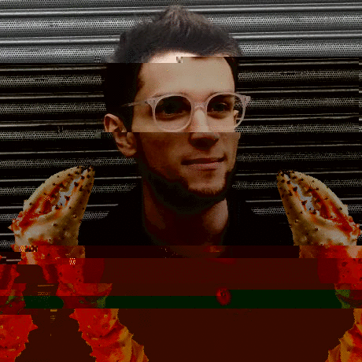
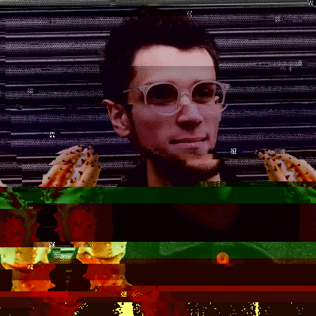

# Image Glitcher

This little node script glitches jpgs by randomly modifying bytes in the original and generating new images, and then assembling those into a gif using Image Magick.

It can turn an innocent image of Dan Crabramov like this:


Into this:



## Usage

```bash
./glitch.js ./images/DanCrabramov.jpg DanGlitched.gif

# Or we can control the glitchiness level by adding a number at the end
# 1 is very low and 50 is super glitchy
# (warning: may just not work if the number is too high)
./glitch.js ./images/DanCrabramov.jpg DanGlitched.gif 50
```

## Levels

<figure class="image">
  
  <figcaption>Low (1)</figcaption>
</figure>

<figure class="image">
  
  <figcaption>Medium (5)</figcaption>
</figure>

<figure class="image">
  
  <figcaption>Medium (15)</figcaption>
</figure>

<figure class="image">
  
  <figcaption>Extreme (50)</figcaption>
</figure>